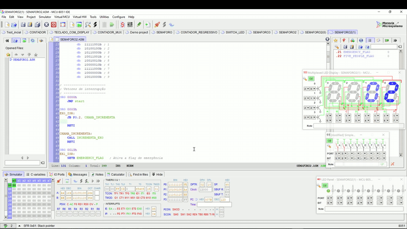
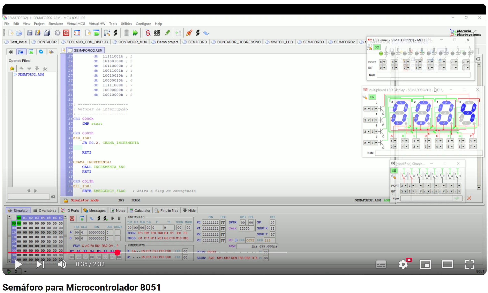

<h1 align="center">Sistemas Embarcados | Semáforo Inteligente</h1>

<div align="center">  
  
</div>

## Objetivo do Projeto

Desenvolver e simular, usando o MCU 8051 IDE, um semáforo inteligente que ajusta os tempos de sinalização com base em variáveis como intensidade do tráfego e veículos de emergência. 


## 🗒️ Lista de requisitos

- SDCC Compiler
- MCU 8051 IDE
- Microcontrolador 8051 (opcional)

## 🛠 Tecnologias

1. **Git e Github**;
2. **MCU 8051 IDE**;
3. **Linguagem Assembly (8051)**;

## 💻 Instruções para Importar, Compilar e Rodar o Código Localmente

Siga os passos abaixo para clonar o repositório, importar no **MCU 8051 IDE**, compilar, executar e simular o código.

1. **Clone o repositório para sua máquina local**  
   Abra o terminal e execute os comandos abaixo:
   ```bash
   git clone https://github.com/alexsami-lopes/Sistemas-Embarcados-Semaforo.git
   cd Sistemas-Embarcados-Semaforo


## 🔧 Funcionalidades Implementadas:

1. O código foi escrito inteiramente em **linguagem Assembly**, atendendo aos requisitos.
2. O sistema foi desenvolvido utilizando exclusivamente os componentes disponíveis no simulador.
3. Foi implementado o Ciclo Normal do Semáforo, operando em loop contínuo através da chave de **Porta 0 e Bits de 0 ao 2** no **"LED Panel" - "Virtual HW"**:
   - **LED Verde** permanece aceso por 10 segundos **(Porta 0 Bit 0)**;
   - **LED Amarelo** permanece aceso por 3 segundos **(Porta 0 Bit 1)**;
   - **LED Vermelho** permanece aceso por 7 segundos **(Porta 0 Bit 2)**.
4. O display de 7 segmentos multiplexado com 4 dígitos **("Multiplexed LED Display" - "Virtual HW")** exibe o tempo decrescente correspondente ao tempo de duração de cada cor, utilizando adequadamente o timer do 8051.
   - A multiplexação (escolha do dígito a ser exibido) é feita através da **Porta 2 e Bits de 0 ao 3**;
   - O acendimento dos segmentos que compõem cada dígito é feito através da **Porta 1 e Bits de 0 ao 7**;
5. Foi implementado o **Modo Emergência** acionado através da **chave de Porta 3 Bit 3** no **"Simple Keypad" - "Virtual HW"**:
   - Quando o botão é pressionado, o sinal vermelho permanece aceso por 15 segundos antes de retomar o ciclo normal;
   - A detecção do botão é realizada através de uma interrupção externa.
   - **O LED da Porta 0 Bit 4** é aceso brevemente para feedback quando o botão **(chave de Porta 3 Bit 3)** é acionado;
6. Foi implementada a **Contagem de Veículos** através do acionamento da **chave de Porta 3 Bit 2** no **"Simple Keypad" - "Virtual HW"**:
   - Quando o botão é pressionado, a quantidade de veículos que está passando pelo sinal é incrementada;
   - Se houver mais de 5 veículos no momento, o tempo de duração do LED Verde aumenta para 15 segundos;
   - A funcionalidade foi implementada utilizando uma interrupção externa.
   - **O LED da Porta 0 Bit 5** é aceso brevemente para feedback quando o botão **(chave de Porta 3 Bit 2)** é acionado 5 vezes; 
7. Foi definida a Prioridade das Interrupções, obedecendo à seguinte hierarquia:
   - Interrupção Externa devido ao Modo de Emergência;
   - Interrupção Externa devido à Contagem de Veículos;
   - Timers.

## 💻 Desenvolvedor
 
<table>
  <tr>

<td align="center"><br /><sub><b> Alexsami Lopes </b></sub></a><br />👨‍💻</a></td>

  </tr>
</table>


## 🎥 Demonstração no Simulador (Preview): 

<div align="center">
  <figure>  
    
    
<figcaption>

**Figura 1** - Preview do Projeto no Simulador - **GIF acelerado**
    </figcaption>
  </figure>
</div>


## 🎥 Demonstração no Simulador (Video): 

<div align="center">
  <a href="https://#" target="_blank">
    
  </a>
</div>
